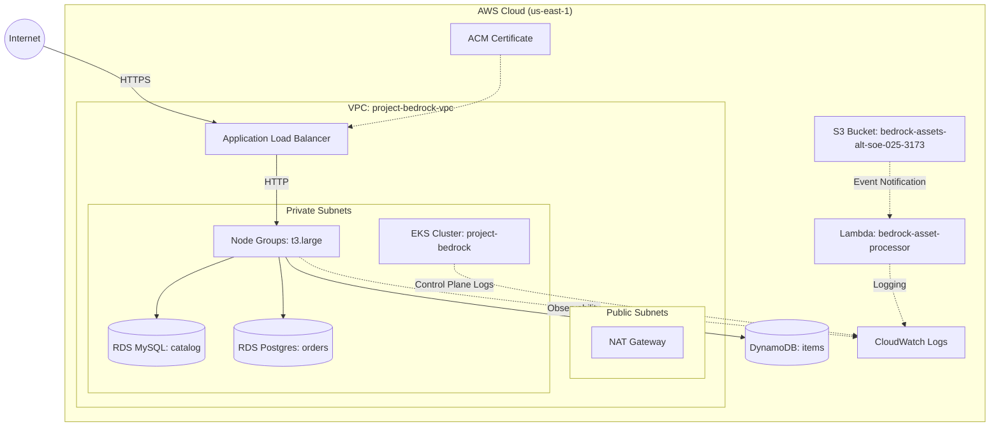

# InnovateMart - Project Bedrock

This repository contains the Infrastructure as Code (IaC) and Application Deployment configurations for Project Bedrock to deploy the Retail Store Application on Amazon EKS.

## Architecture



## Deployment Guide

1. **Triggering the Pipeline**: The CI/CD pipeline triggers automatically using GitHub Actions. 
   - Opening a Pull Request to `main` runs `terraform plan`.
   - Merging the PR into `main` automatically runs `terraform apply` to deploy all resources.

2. **Accessing the Retail Store**: 
   - The application is exposed securely via AWS Application Load Balancer using an ACM TLS certificate.
   - Run `kubectl get ingress -n retail-app` to retrieve the ALB domain endpoint.
   - Navigate to `https://<ALB-DOMAIN>` in your browser.

## Security & Grading Credentials

- The IAM User `bedrock-dev-view` has been deployed enabling secure ReadOnly access for developers. 
- Infrastructure generates `grading.json` via terraform outputs.

### Manual Helm Deployment (Bonus Objective 5.1 Verification)

If not using Terraform to apply the Helm release automatically, you can deploy the wrapped chart with a single command passing the custom data layer overrides:

```bash
helm upgrade --install retail-app ./kubernetes/retail-store-sample-chart \
  --namespace retail-app --create-namespace \
  -f ./kubernetes/custom-values.yaml
```
*(Ensure all placeholder values in `custom-values.yaml` and Kubernetes Secrets are fulfilled using your provisioned AWS resources).*
